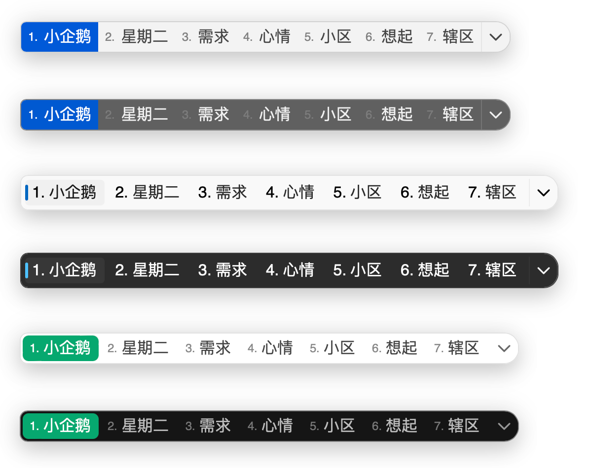
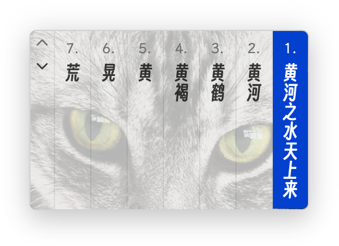
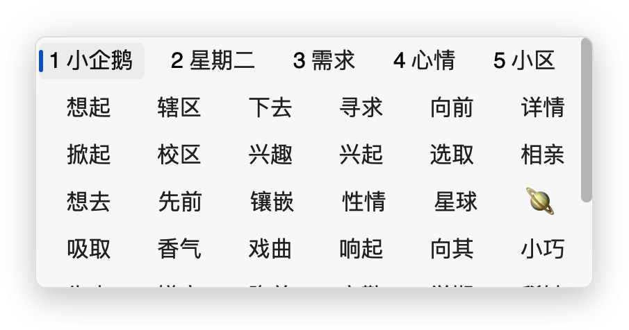

# 简介

小企鹅输入法框架（以下简称小企鹅）起源于 Linux，后被移植到了 Android 和 macOS。

作为输入法框架，它支持多种输入法（即我们常说的拼音输入法、五笔输入法、日语输入法等）。

不同平台上的小企鹅拥有相似的输入体验，并各有一些平台特色的功能。

请在 [GitHub](https://github.com/fcitx-contrib/fcitx5-macos-installer/blob/master/README.zh-CN.md) 下载适用于 macOS 的安装包，并在 `高级` -> `数据管理` 导入其他输入法的配置（可选）。

* 对于大多数用户，拼音版（包含了双拼和五笔）是最佳选择。

* 小企鹅安卓版用户，请根据您安装的插件情况选择安装包，并导入安卓版的备份文件。

* 鼠须管用户请下载中州韵版，并一键导入鼠须管的方案文件。

* 仓输入法用户请下载中州韵版，并导入仓的备份文件。

* 其他平台的 Rime 用户请下载中州韵版，并手动导入方案到 `~/.local/share/fcitx5/rime`。

* 小企鹅 Linux 版用户，请下载原装版，并使用插件管理器安装引擎。

## 展示

### 多彩皮肤

（背景图：[Close Up Photography of White and Black Cat](https://www.pexels.com/photo/close-up-photography-of-white-and-black-cat-69932/), CC0 许可）

### 卷轴模式

### 深度定制

[定制 CSS](./theme/css.md) 可以深度个性化界面，异形窗口等也可实现：

